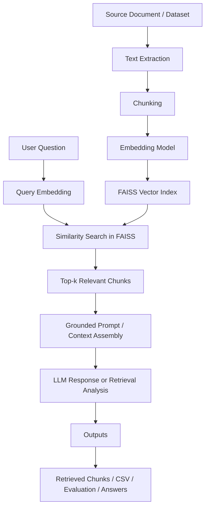
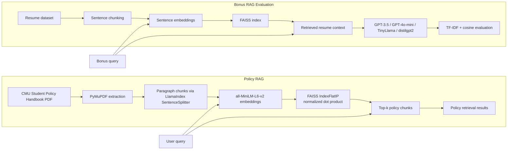

# AI Policy RAG QA System

Retrieval-Augmented Generation (RAG) project for answering policy questions from a large university handbook and evaluating how retrieval choices, chunking strategy, similarity search, and LLM selection affect answer quality.

This repository documents a coursework-driven but practical end-to-end RAG workflow built around the **CMU student policy handbook**. The main system turns a long policy document into searchable chunks, embeds them into a **FAISS** vector index, retrieves the most relevant passages for a user question, and uses those passages as grounded context for downstream question answering and analysis.

It also includes a **bonus agentic / multi-model experiment** that applies the same RAG idea to a resume dataset and compares how different LLMs respond when given retrieved context.

## Problem Statement

Large policy documents are difficult to search manually. Users often ask natural-language questions such as:

- What is the academic integrity policy?
- What counts as cheating?
- What are the quiet hours?
- Where are pets allowed?

Traditional keyword search can miss relevant answers when the wording in the question does not exactly match the wording in the document. The goal of this project is to build a RAG pipeline that improves policy lookup by:

- converting the handbook into semantically meaningful chunks,
- embedding those chunks into a vector space,
- retrieving the most relevant passages for a question, and
- using the retrieved text as grounded context for answer generation and evaluation.

## What Was Built

### Core policy QA pipeline

The main notebook, [policy-rag-qa.ipynb](/c:/Personal/Aravinda%20Stuff/CMU/3rd%20semester/Gen%20AI%20Lab/Homework/Homework%202/ai-policy-rag-qa-system/policy-rag-qa.ipynb), implements:

- PDF ingestion of the CMU student handbook using **PyMuPDF**
- paragraph-oriented chunking with **LlamaIndex `SentenceSplitter`**
- chunk size of **512 characters** with **50-character overlap**
- text embeddings using **`sentence-transformers/all-MiniLM-L6-v2`**
- vector search with **FAISS**
- normalized embeddings with **dot-product / inner-product retrieval**
- query experiments across 5 required policy questions
- export of retrieval outputs for homework analysis

### Bonus RAG + model comparison workflow

The second notebook, [resume-rag-model-comparison.ipynb](/c:/Personal/Aravinda%20Stuff/CMU/3rd%20semester/Gen%20AI%20Lab/Homework/Homework%202/ai-policy-rag-qa-system/resume-rag-model-comparison.ipynb), extends the same pattern to resume search and compares multiple LLMs on top of retrieved context:

- sentence-level chunking of resume data
- embeddings with `bert-base-nli-mean-tokens` in the earlier version and `all-MiniLM-L6-v2` in the updated version
- FAISS retrieval for top-k resume context
- OpenAI and Hugging Face model calls for response generation
- response-vs-response and response-vs-context similarity evaluation using **TF-IDF + cosine similarity**
- export of summary results to CSV

## End-to-End Architecture



### Project-specific implementation



## Technical Stack

- **Language**: Python
- **Development format**: Jupyter notebooks / Google Colab style workflow
- **Document parsing**: PyMuPDF (`fitz`), `pypdf`
- **Chunking**: LlamaIndex `SentenceSplitter`, NLTK sentence tokenization
- **Embeddings**: `all-MiniLM-L6-v2`, `bert-base-nli-mean-tokens`
- **Vector store**: FAISS
- **LLM providers / APIs**:
  - OpenAI API
  - Hugging Face Hub / inference endpoints
- **Evaluation utilities**:
  - TF-IDF
  - cosine similarity
  - manual qualitative retrieval analysis
- **Data handling**: pandas, NumPy

## Models and APIs Used

From the notebooks and report, the project references these models/services:

- **Embedding models**
  - `sentence-transformers/all-MiniLM-L6-v2`
  - `bert-base-nli-mean-tokens`

- **LLMs**
  - `gpt-3.5-turbo`
  - `gpt-4o`
  - `gpt-4o-mini`
  - `meta-llama/Llama-3.2-1B` in earlier experimentation
  - `TinyLlama/TinyLlama-1.1B-Chat-v1.0`
  - `distilgpt2`

- **APIs / endpoints**
  - OpenAI API for GPT-based generations
  - Hugging Face token/authentication and inference usage for non-OpenAI models

## Retrieval Design Choices

The main policy RAG pipeline uses the following retrieval design:

- **Chunking strategy**: paragraph-based chunking with overlap
- **Chunk size**: 512 characters
- **Overlap**: 50 characters
- **Embedding model**: `all-MiniLM-L6-v2`
- **Similarity metric**: dot product on normalized embeddings
- **Vector index**: FAISS `IndexFlatIP`
- **Default retrieval depth for required homework queries**: `k = 5`

These choices were made to balance:

- semantic coherence of chunks,
- enough surrounding context to avoid fragmented policy text,
- fast nearest-neighbor retrieval,
- and better precision than broad keyword matching.

## Main Experiments

### Part A: Vector store query design

The project tests retrieval against five policy questions:

1. What is the policy statement for the academic integrity policy?
2. What is the policy violation definition for cheating?
3. What is the policy statement for improper or illegal communications?
4. What are CMU's quiet hours?
5. Where are pets allowed on CMU?

This section focuses on:

- chunking and embedding the handbook,
- retrieving top-5 relevant chunks,
- analyzing the effect of similarity metrics conceptually,
- and qualitatively judging how well the vector store matched user intent.

### Part B: Query and k-value experimentation

The report discusses changing:

- query wording,
- retrieval depth (`k`),
- and chunking method

to study how retrieval quality changes under different design decisions.

### Bonus: Multi-model RAG comparison

The bonus notebook applies a similar pipeline to resumes and compares multiple LLMs on retrieved context using:

- response-to-response similarity
- response-to-context similarity
- qualitative comparison of stronger vs. weaker models

## Key Findings

Based on the notebooks and accompanying report:

- The system performs best when the user query closely matches the wording used in the handbook.
- Specific policy queries such as **quiet hours**, **pets**, and **academic integrity** retrieve strong results.
- Broader or differently worded queries, such as asking about **cheating** when the source text may use different terminology, are harder to retrieve precisely.
- `k = 5` was judged to be a strong balance between useful context and retrieval noise for the policy task.
- Stronger instruction-tuned models such as GPT-family models produced more coherent grounded answers than lightweight baseline models in the bonus experiment.

## Infrastructure and Workflow

This project is implemented as a lightweight notebook-based RAG prototype rather than a deployed application.

### Current infrastructure

- local / Colab-style notebook execution
- environment variables loaded from `.env`
- external document source loaded from Google Drive paths during experimentation
- in-memory FAISS index creation at runtime
- API-based access to OpenAI and Hugging Face models
- CSV / spreadsheet exports for reporting and evaluation

### What this means

- There is no production web app or backend service in this repository.
- The project demonstrates the **full technical pipeline** for retrieval, ranking, grounding, and evaluation.
- The notebooks are best understood as a reproducible prototype and research workflow.

## Repository Contents

- [policy-rag-qa.ipynb](/c:/Personal/Aravinda%20Stuff/CMU/3rd%20semester/Gen%20AI%20Lab/Homework/Homework%202/ai-policy-rag-qa-system/policy-rag-qa.ipynb)
  Main policy-document RAG workflow.

- [resume-rag-model-comparison.ipynb](/c:/Personal/Aravinda%20Stuff/CMU/3rd%20semester/Gen%20AI%20Lab/Homework/Homework%202/ai-policy-rag-qa-system/resume-rag-model-comparison.ipynb)
  Bonus multi-model RAG evaluation notebook.

- [HW2-Gen AI Lab-Group-9.docx](/c:/Personal/Aravinda%20Stuff/CMU/3rd%20semester/Gen%20AI%20Lab/Homework/Homework%202/ai-policy-rag-qa-system/HW2-Gen%20AI%20Lab-Group-9.docx)
  Written analysis and experiment discussion.

- [bonus_results (1).csv](/c:/Personal/Aravinda%20Stuff/CMU/3rd%20semester/Gen%20AI%20Lab/Homework/Homework%202/ai-policy-rag-qa-system/bonus_results%20(1).csv)
  Exported results from the bonus evaluation workflow.

- [rag_hw02_submission_Solution - Sheet1.xlsx](/c:/Personal/Aravinda%20Stuff/CMU/3rd%20semester/Gen%20AI%20Lab/Homework/Homework%202/ai-policy-rag-qa-system/rag_hw02_submission_Solution%20-%20Sheet1.xlsx)
  Submission spreadsheet / experiment outputs.

## How To Run

### 1. Install dependencies

The notebooks reference these packages:

```bash
pip install pymupdf pypdf faiss-cpu llama-index sentence-transformers transformers pandas numpy nltk python-dotenv scikit-learn openai
```

### 2. Create a `.env` file

```env
OPENAI_API_KEY=your_openai_api_key
HF_TOKEN=your_huggingface_token
HF_INF_TOKEN=your_huggingface_inference_token
```

### 3. Provide the source files

You will need access to the source documents/datasets used in the notebooks, including:

- the CMU student policy handbook PDF
- the resume dataset used in the bonus notebook

### 4. Run the notebooks

Open and execute:

- `policy-rag-qa.ipynb` for the policy QA workflow
- `resume-rag-model-comparison.ipynb` for the bonus multi-model experiment

## Limitations

- This repository is notebook-first, so parts of the workflow are exploratory rather than packaged into reusable modules.
- Some data paths are tied to the original experimentation environment (for example, Google Drive paths).
- Retrieval performance depends heavily on query phrasing and document wording.
- The project demonstrates RAG retrieval and evaluation, but not a production serving layer, authentication layer, or UI.

## Future Improvements

- package the pipeline into reusable Python modules
- add a simple Streamlit or FastAPI interface for interactive policy Q&A
- support hybrid retrieval with keyword + vector search
- add reranking to improve precision on ambiguous policy questions
- implement automatic evaluation with BLEU, ROUGE, and BERTScore
- containerize the workflow for easier reproducibility

## Why This Project Matters

This project shows practical understanding of:

- retrieval-augmented generation
- vector databases and similarity search
- document chunking and embedding strategy
- grounded prompting for LLMs
- model comparison and evaluation
- turning messy long-form documents into usable AI search systems

For recruiters and technical reviewers, this repository demonstrates both **hands-on LLM engineering** and an understanding of the design tradeoffs behind real-world RAG systems.

## License

This project is available under the [MIT License](/c:/Personal/Aravinda%20Stuff/CMU/3rd%20semester/Gen%20AI%20Lab/Homework/Homework%202/ai-policy-rag-qa-system/LICENSE).
